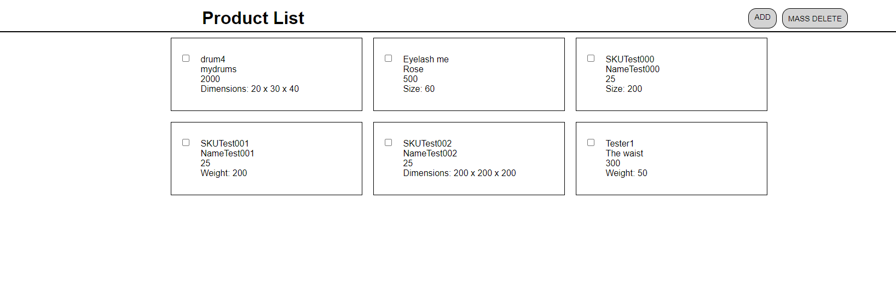

<p align="center">
  <a href="" rel="noopener">
 </a>
</p>

<h3 align="center">Scandiweb Task</h3>

<div align="center">

[]()

</div>

---

<p align="center"> Junior Web Developer Project.
    <br> 
    https://bolex-scandi-task.000webhostapp.com/
</p>

## 📝 Table of Contents

- [About](#about)
- [Usage](#usage)
- [Backend](#backend)
- [Frontend](#frontend)
- [Deployment](#deployment)
- [Author](#authors)

## 🧐 About <a name = "about"></a>

This project is a task for the junior developer role.


### Prerequisites

#### Backend 
    To run the project locally, you need an Apache Webserver.

   - You can use [@XAMPP](https://www.apachefriends.org/pt_br/index.html) or [@MAMP](https://www.mamp.info/en/windows/)

#### Frontend
  You would need to install npm and node.js, to access react on your local machine.

## ⛏️ Backend <a name = "backend"></a>
  The backend is made using php(plain classes, no frameworks, and using the OOP approach) along with other specification and requirements in the test

## ⛏️ Frontend <a name = "frontend"></a>
  The frontend is made using react.

## 🚀 Deployment <a name = "deployment"></a>

  To deploy the frontend on your local machine, you would need to change into the frontend and Scandi_web_fe directory using the command below

  ```
    cd frontend/Scandi_web_fe  

  ```
  Install dependencies in the package.json:

  ```
  npm i

  ```
  Then run the project using:

  ```

  npm run dev

  ```
## ✍️ Author <a name = "authors"></a>

- [@bolex](https://github.com/bolexs)

#### Screenshot


